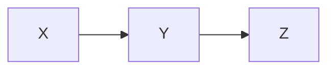

In [Entropy, Prefix Codes, and KL Divergence](), a single random variable $X$ is described by a prefix code, and the optimal expected code word length is the entropy $H(X)$. With two variables, the same coding picture gives three more quantities. Describing the pair $(X, Y)$ costs the [joint entropy](https://en.wikipedia.org/wiki/Joint_entropy) $H(X, Y)$. If the receiver already knows $Y$, the remaining cost is the [conditional entropy](https://en.wikipedia.org/wiki/Conditional_entropy) $H(X \mid Y)$. The difference is the [mutual information](https://en.wikipedia.org/wiki/Mutual_information): the number of bits that knowing one variable saves in describing the other.

## Joint Entropy

The joint entropy is ordinary entropy applied to the joint distribution:

$$
H(X, Y) = -\sum_{x, y} p(x, y) \log_2 p(x, y)
$$

Keep the source from the previous post: $p = (\frac{1}{2}, \frac{1}{4}, \frac{1}{8}, \frac{1}{8})$ over $\{a, b, c, d\}$ with Huffman code $a = 0$, $b = 10$, $c = 110$, $d = 111$, so $H(X) = 1.75$ bits. Let $B$ be the first bit of the code word for $X$. Only four pairs can occur:

| pair $(x, b)$ | $p(x, b)$ |
| --- | --- |
| $(a, 0)$ | $\frac{1}{2}$ |
| $(b, 1)$ | $\frac{1}{4}$ |
| $(c, 1)$ | $\frac{1}{8}$ |
| $(d, 1)$ | $\frac{1}{8}$ |

Since $B$ is determined by $X$, the pair is no harder to describe than $X$ alone: $H(X, B) = H(X) = 1.75$ bits. At the other extreme, if $Y$ is an independent fair coin, then $H(X, Y) = H(X) + H(Y) = 2.75$ bits, and the uncertainties simply add. Between these extremes, the general decomposition is the chain rule:

$$
\boxed{H(X, Y) = H(Y) + H(X \mid Y)}
$$

Describe $Y$ first, then describe what remains of $X$ once $Y$ is known.

## Conditional Entropy

Each value of $Y$ induces a posterior distribution on $X$, and the conditional entropy averages the posterior entropies:

$$
H(X \mid Y) = \sum_y p(y) H(X \mid Y = y) = -\sum_{x, y} p(x, y) \log_2 p(x \mid y)
$$

In the example, seeing $B$ splits the problem in two. If $B = 0$, then $X = a$ with certainty and $H(X \mid B = 0) = 0$. If $B = 1$, then $X$ is $b$, $c$, or $d$ with conditional probabilities $(\frac{1}{2}, \frac{1}{4}, \frac{1}{4})$, which has entropy $1.5$ bits. Averaging over the two branches:

$$
H(X \mid B) = \frac{1}{2}(0) + \frac{1}{2}(1.5) = 0.75 \text{ bits}
$$

The coding interpretation: if both sender and receiver already know $B$, the remaining description of $X$ costs $0.75$ bits on average. The first bit of the code word had already paid $1$ of the original $1.75$ bits. This is also the rate for coding $X$ when $Y$ is available at the receiver as side information, and by the [Slepian–Wolf theorem](https://en.wikipedia.org/wiki/Slepian%E2%80%93Wolf_coding) that rate is achievable even when the sender does not know $Y$. On average, conditioning never hurts: $H(X \mid Y) \leq H(X)$, though a particular value of $Y$ can make a particular $X$ more surprising.

## Mutual Information

The mutual information is the reduction in uncertainty:

$$
I(X; Y) = H(X) - H(X \mid Y)
$$

Here, $I(X; B) = 1.75 - 0.75 = 1$ bit: the first code bit carries exactly one bit about the symbol. The chain rule makes the definition symmetric, since the same quantity equals $H(Y) - H(Y \mid X)$. In the example, $H(B) = 1$ and $H(B \mid X) = 0$, so $I(B; X) = 1 - 0 = 1$ bit, as it must. The three standard forms are:

$$
\boxed{I(X; Y) = H(X) + H(Y) - H(X, Y) = D_{KL}\big(p(x, y) \,\|\, p(x)p(y)\big)}
$$

The KL form ties back to the previous post: $p(x)p(y)$ is the joint distribution the pair would have if $X$ and $Y$ were independent, so mutual information is the excess cost of coding the pair with a code built on the independence assumption. By Gibbs' inequality, $I(X; Y) \geq 0$, with equality exactly when $X$ and $Y$ are independent, and $I(X; Y) \leq \min(H(X), H(Y))$, since two variables cannot share more uncertainty than either contains. The pointwise term $i(x; y) = \log_2 \frac{p(x, y)}{p(x)p(y)}$ can be negative for a single pair, when seeing $y$ makes $x$ less likely than it was before; only the average is guaranteed non-negative.

## What It Buys

Mutual information chains the same way entropy does. For a second observation $Z$:

$$
I(X; Y, Z) = I(X; Z) + I(X; Y \mid Z)
$$

so each new observation is credited only with the uncertainty it removes beyond what was already known. And if $X \rightarrow Y \rightarrow Z$ is a Markov chain, the [data processing inequality](https://en.wikipedia.org/wiki/Data_processing_inequality) gives $I(X; Z) \leq I(X; Y)$: summarizing, re-encoding, or corrupting $Y$ cannot create information about $X$ that was not already there.

The noisy version of the running example shows the inequality in action. Send $B$ through a channel that flips it with probability $\varepsilon$, and call the received bit $R$. Then $I(B; R) = 1 - h_2(\varepsilon)$, where $h_2$ is the binary entropy function. At $\varepsilon = 0.1$ the receiver still gets $0.531$ bits of the original $1$ bit; at $\varepsilon = \frac{1}{2}$ the received bit is independent of the sent bit and $I(B; R) = 0$. How much of $X$ survives a noisy $Y$ is the question that channel coding answers.
